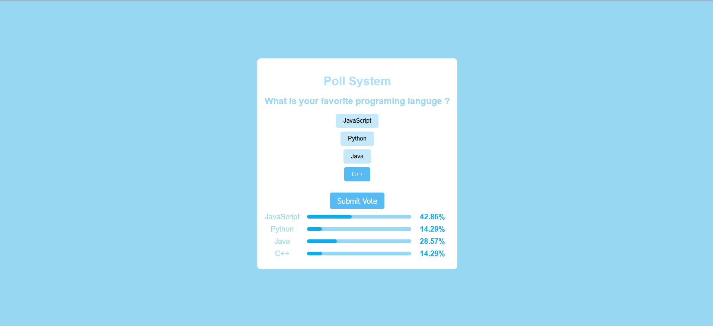
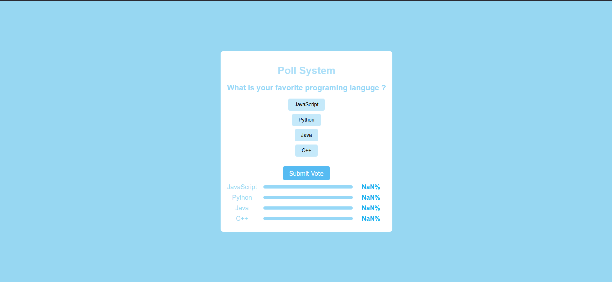

## Poll System App
This project is a simple Poll System app built using JavaScript. It allows users to vote and submit their skills, it not complete indicating how well they know certain skills.


## How To Use :

To use the Poll System app, follow these steps:

1. Clone the repository by running the following command in your terminal:
```bash
git clone https://github.com/chebichebkheireddine/Pol-system-App.git
```

2. Open the `index.html` file in your web browser.

3. The app will be displayed on the screen with skills to vote .

Enjoy using the Poll System app!


